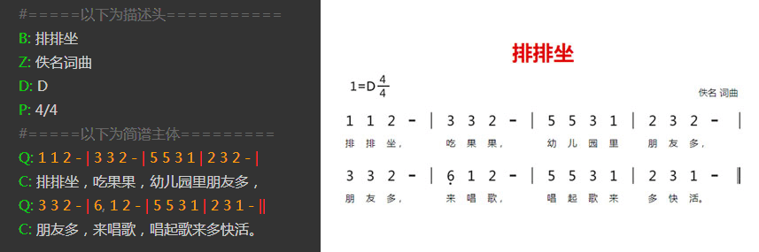

# 番茄脚本简介

## 什么是番茄脚本？

番茄脚本，全称是 **番茄简谱脚本** ，是由我们参考国外流行的ACB记谱法，同时结合简谱的特性所设计的一套简谱脚本。

简单的说，番茄脚本就是通过普通的文本的形式，将简谱完整的描述出来的一种规范。

通过番茄脚本，可以快速的将一篇简谱录入到计算机中处理。

### 文件扩展名

**注：原始文档没有本节内容**

番茄脚本的扩展名为 **.jps**， 含意为简谱脚本(jianpu script) 或简谱源码(jianpu source)。

### 番茄脚本的结构

一个完整的番茄脚本，应由描述头和简谱主体构成。

 **描述头** ：主要是记录一些简谱的基础信息，像标题、词曲作者、调式、拍号、拍子等。

 **简谱主体** ：记录着每一行的词和曲的信息。

## 一个简单的示例：

##### 

上图中，左侧是一个简单番茄脚本。右侧是将其导入到相应软件后得到简谱图片。

这是一个非常简单的示例，当然在实际应用中还会更跟复杂的谱子出现，但是番茄脚本已经解决了大部分的需求，包括各种符号和多声部的输入等。具体请参看本手册的相应章节。

## 番茄脚本的优点：

1、速度快，当您熟练以后，将实现以打字的速度录入简谱，比使用其他简谱软件排版快的多。

2、编写方便，只要能够输入文本的编辑器都可以编写（记事本、Word、手机编辑器）。

3、通过相应软件，可以很方便的生成高质量的简谱图片或MIDI音频，同时分享到互联网中。
