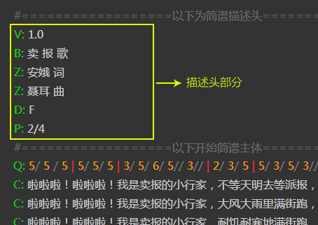

## 描述头图例

以上脚本中，以“#”开头的行是注释行，仅方便阅读，无实质作用。

## 描述头说明

描述头是由许多行组成，一般写在脚本顶部。每行标记一项简谱或脚本的基本信息，如：标题、副标题、作者、调式等。每一项信息使用“大写字母”作为标识，每个大写字母的意义如下：

字母| 说明| 示例| 必须
---|---|---|---
V| 版本号| V: 1.0| 是
B| 标题| B: 排排坐| 是
Z| 作者| Z: 佚名 词曲| -
D| 调式| D: E| 是
P| 拍号| P: 4/4| 是
J| 节拍| J: 6 或 J: 欢快的| -
X| 序号| X: 10 | -

 **V 脚本版本号**

用来指定当前谱脚本是使用哪个版本的脚本规范，主要是因为后期可能会对脚本规范进行调整，衍生出不同的版本规范。

 **B 曲谱标题**

由于一些曲谱有主标题还有附标题，所以B字段可以多次出现。第一次出现将被认为是主标题，第2词以后出现的被认为是附标题。  
在番茄简谱软件中，曲谱标题是居中显示的，也可以用来写居中显示的其他文字。

 **Z 作者**

由于一般情况下曲谱作者可能有多个，所以Z字段可以出现多次。  
在番茄简谱软件中，作者分别由上到下地居右显示，也可以用来显示列在乐谱右上边的其他文字。

 **D 调式标志**

调式必须是一个大写的字母，在字母后面可以加”＃”或“$”表示升降调。

 **P 拍号**

使用“/”作为分号线，写法如：P:6/8  或  P:4/4，同时可以指定多个拍号，例：p:4/4 2/4；辅助拍号也可以加上括弧，例如：P:4/4 (
2/4 1/4 )

 **J 节拍**

节拍可以使用数字或文字表示，当使用数字时，软件将识别为每分钟的拍子数。如果使用文字描述，则直接将文字显示在拍号下方位置。可以两者并存。

## 脚本注释  

以“#”开头的行是作为脚本注释所用，仅作为标注脚本说明等用。在软件渲染的时候，将被忽略。

