# 曲部分

## 简谱主体说明

简谱主体仅包含词和曲两种内容，每行内容对应简谱中的每一行，行开头以Q或C定义内容类型，Q表示曲，C表示词。如下图：

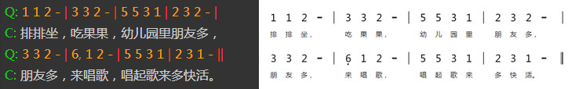

需要注意的是，主体中的词是依附于上一行的曲的。所以主体应该以Q（曲）开头。而一行曲可以对应多行词，就像下面这样：  

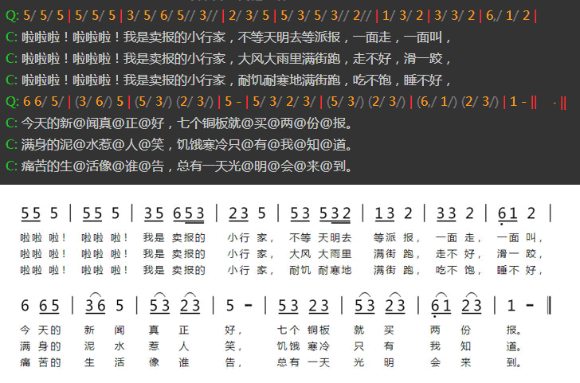

## 基本音符/休止符

### 普通音符

普通音符使用“1-7”数字表示，对应简谱的“1、2、3、4、5、6、7”这7个音符。增时线使用“-”表示。如下图：

### 休止符

休止符使用数字“0”表示，而数字“8”则表示隐藏的休止符（在谱面上不可见，但是占据相应的空间）。  

### 节奏音符

节奏音符“X”使用数字“9”表示。

 **示例：**

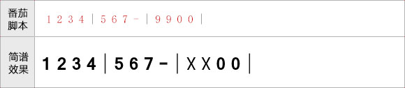

### 高低音的表示

高音使用“ **'** ”表示，低音使用“ **,** ”表示。跟在数字后面即可。高低音符号可以有多个，如下图所示：

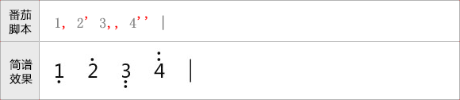

## 增时线/减时线

增时线使用“-”表示，如下图：

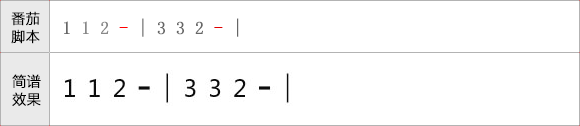

减时线（时值线）使用“/”表示，跟在音符数字的后面，一个音符可以包含多个。如下图：

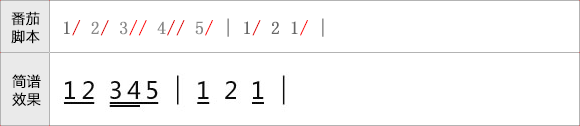

## 自定义节拍切分

**因为番茄脚本开发初期的失误，导致自动节拍都是以四分音符为一拍进行自动切分的。**

因此，导致例如6/8和一些特殊情况的节拍切分不能实现。  

为了解决此问题，后期我们增加了“~”和“^”来协助实现自定义切分节拍。

“~”符号的作用：让前后音符串接在一个节拍中。

“^”符号的作用：让前后音符强制切开为两个节拍。

加入~和^符号只是临时解决问题的策略，我们将在后期的新版中彻底解决此问题。

 **示例如下：**

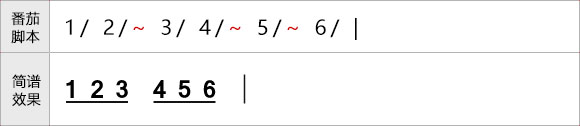

 
## 附点音符

附点音符，只需要在音符数字后面加上“.”号即可。双附点音符加上两个“.”。如下图：

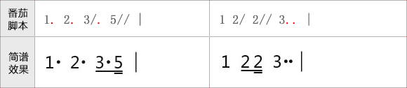

## 力度/渐强/渐弱

力度术语可以在音符后面加上“&+缩写字母”的方式加上，例如mp写上“&mp”即可。

渐强渐弱符号，则使用“<”或“>”表示起点，终点直接使用“!”作为结束记号。

如下图：

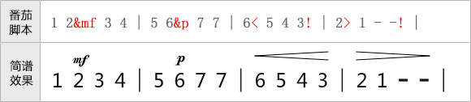

番茄脚本支持的力度术语一览表：

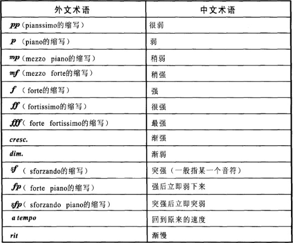

 **渐强减弱符号与连音线等符号重叠问题**

有些时候，渐强减弱符会与连音符重叠，此时可以在渐强减弱符的“<”或“>”后加上“+”号进行调整，“+”号越多，渐强减弱符越上移。

示例如下：

图1、渐强减弱与连音线重叠问题:

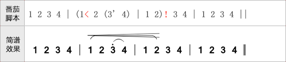

图2、通过“+”号调整渐强减弱符的位置

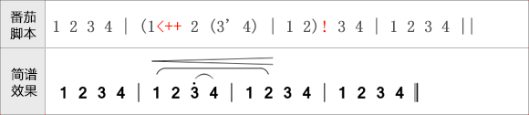

番茄简谱将在以后实现渐强减弱符号位置的自动调整，在此之前请使用“+”号手动调整。

## 升降音/还原符号

升音符使用“#”表示；降音符使用“$”表示；还原符使用“=”表示；以上符号均写在音符数字的后方。如下图：

## 装饰音（倚音）

前倚音使用中括号“[]”包含起来即可，跟在音符数字后即可。“[]”括弧中的音符可以包含高低音符号“,”和“'”，同时支持减时线符“/”以及升降音符。后倚音则也使用相同的方法，不同的是要在“[”后面加上一个“h”，例如。

需要注意的是，倚音里的音符，默认就是8分音符，当加了一条减时线后，将变成16分音符。如下图：

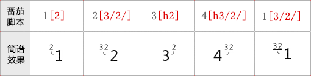

## 伴奏部分的括弧

在曲的伴奏部分，一般会使用括弧括起来。在番茄脚本中，左括弧使用“&zkh”表示，右括弧使用“&ykh”表示。

需要注意的是，不管是左括弧还是右括弧，均写在音符数字的后面。如下图所示：

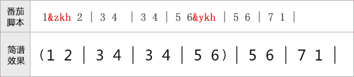

## 其他常用音符符号

在简谱音符中，有非常多的装饰符号。这些装饰符号在番茄脚本中均一般使用“&+符号编码”进行表示。  

为了方便记忆，大部分符号的编码是使用符号名称的拼音首字母表示的。常用记号如下表格所示：

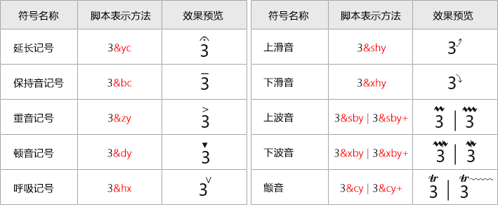

## 音符注释

如果某个音符上方需要注释，只需要在音符数字后面将注释使用双引号包含起来即可，如下图所示：

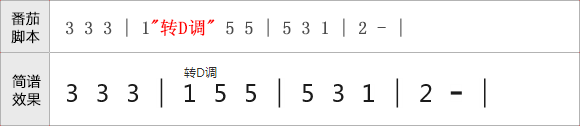

## 小节线

番茄脚本中，各种类型的小节线表示方法，请参考下图：

 **隐藏小节线的说明**

隐藏小节线1（|/）：此隐藏小节线不会显示，也不会占据排版空间，一般是用于每一行的开头的，因为有些符号是只能在小节线上标注的（例如跳房子的起点），但是每一行的开头一般是省略小节线的。此时就需要使用隐藏的小节线了。

隐藏小节线2（|*）：此隐藏小节线不会显示，但是会占用排版空间，一般用行中间单声部变多声部时。具体情参看多声部章节。

## 小节线上的反复符号

以下反复符号只有在小节线处才可以使用：

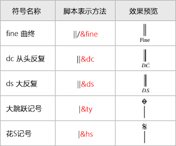

## 连音线

需要用连音线连起来的音符，使用“()”包含起来即可，连音线可以嵌套使用，并且支持跨小节和跨行。  

具体如下图所示：

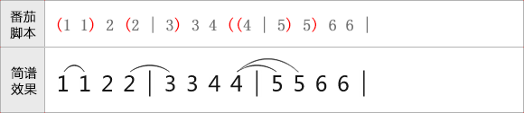

 **跨行连音线**

当相同页面中连音线跨行时，请直接使用在第二行编写右括弧即可，如下：

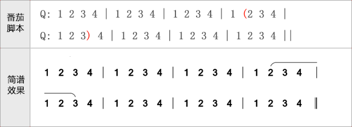

 **切分连音线**

有些时候，连音线会被切分。例如跳房子处的连音线和分页处的连音线。此时可以将跳房字的括弧写在小节线处，如下：

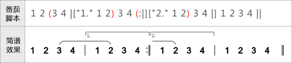

## 连音/多连音

连音和多连音的表示方法和连音线差不多，都使用“()”包含起来，不同的时，连音需要在“(”后面加上小写字母“y”。  

连音的音符数软件加自动计算。如下图所示：

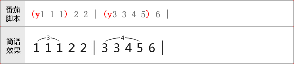

## 跳房子

跳房子只能在小节线上标注，使用“[]”表示。“[”表示起点，“]”表示终点，跳房子线支持跨行。  
小节线下的备注信息，则在小节线后使用引号括起来（类似音符备注）即可。  
为了方便后期导出MDID和软件正确播放，跳房子的备注文字建议使用数字表示。  
用法如下图所示：

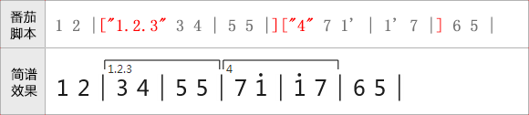

还有一种情况，当跳房子的段落太长的时候，一般跳房子只需要画到前两个小节，然后右侧无需封闭即可。  
此中情况，可以在“[”号后面增加“/”符即可。如下所示：

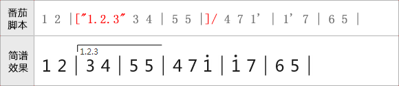

 **跳房子与连音线等重叠问题**

有些时候，跳房子默认的高度会与连音符重叠，此时可以在跳房子的“[”后加上“+”号进行调整，“+”号越多，跳房子里音符越远。

示例如下：

图1、跳房子与连音线重叠问题:

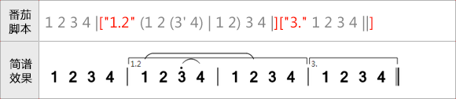

图2、通过“+”号调整跳房子线的位置

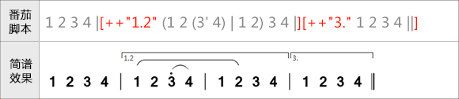

番茄简谱将在以后实现跳房子位置的自动调整，在此之前请使用“+”号手动调整。

 **行开头处的跳房子**

跳房子标记只能写在小节线处，但是有些时候跳房子是从行头开始的，而行头却不应该有小节线。此时可以使用隐藏小节线“|/”处理。

如下图所示：

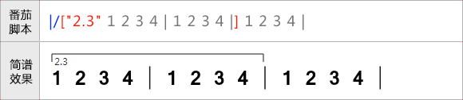

## 临时拍号

临时拍号的定义直接写在小节线的备注中（在小节线后面使用引号包含起来），格式是“p:x/x”。  
如下图所示：

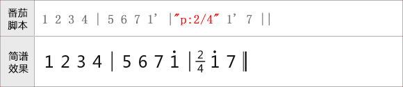

## 临时伴奏/临时多声部

临时伴奏一般是在主唱和伴奏重叠的时候，将伴奏写在主旋律的上方。番茄脚本在表示临时伴奏时，伴奏部分使用“{}”括起来，并且在“{”后面要紧跟着小写字母“bz”。软件会自动将音符和主旋律对齐。如下图所示：

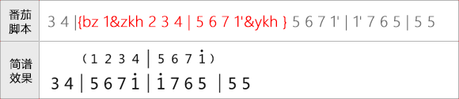

临时多声部的方法和临时伴奏差不多，不同的是在“{”符号后面紧跟着的字母换成了“dsb”。如下图所示：

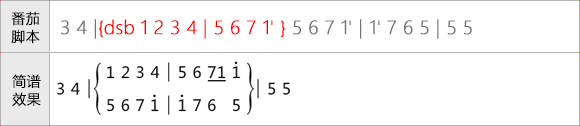

## 多声部

在编写单声部简谱的时候，词曲的行开头是使用“Q”和“C”进行定义的。而当编写多声部时，只需要在每个声部的“Q”和“C”后面加上一个声部编号即可。如下图所示：

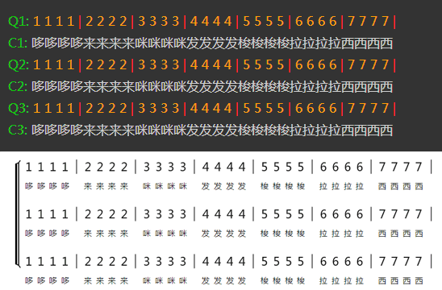

在多声部时，您还可以在声部编号数字的后面用双引号表示声部的名称，如下图：

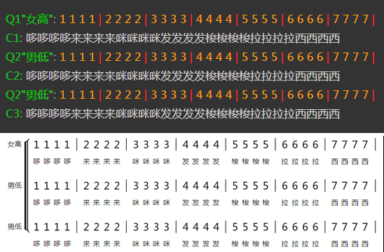

多声部和单声部可以混合使用的，下面是一个示例：  

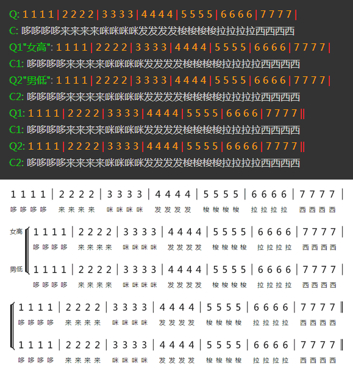

 **自定义声部括弧的位置**

有些时候，多声部可能是在一行的中间开始的，此时可以在脚本中使用“&sbf”来定义声部括弧的位置。

同时，除第一个声部外的其他声部，在声部符前是没有内容的，可以使用“8”（隐藏空白音符）和“|*”（隐藏小节线）进行填充。

示例如下：

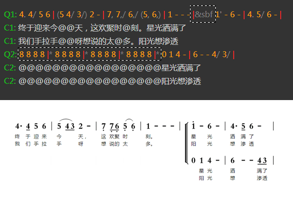

## 分页

番茄简谱目前只能手动分页，需要分页时，请在新一行的脚本中输入“[fenye]”即可。

需要注意的时，连音线不能自动跨页，请参考连音线章节通过切分连音线进行处理。

分页示例如下：

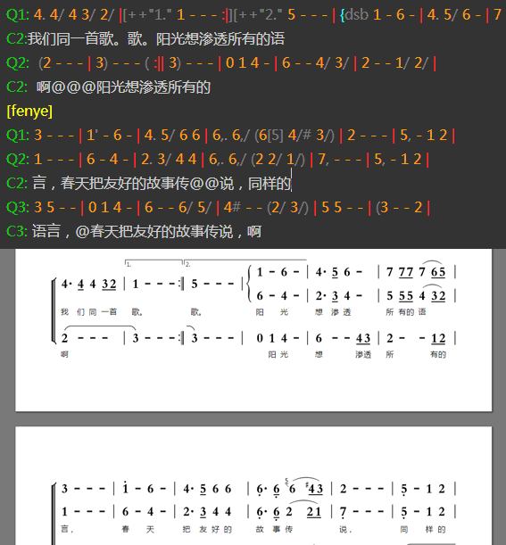

