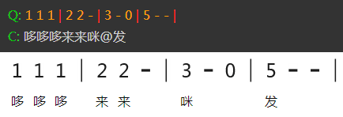
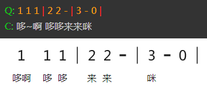
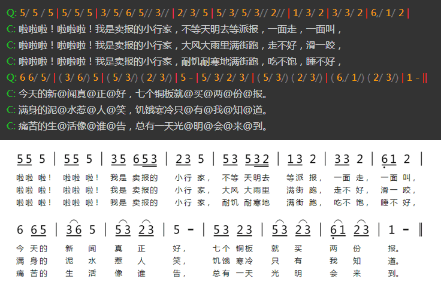
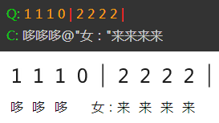
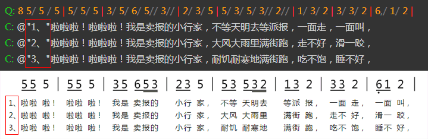
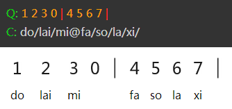

# 歌词部分

## 中文歌词

简谱主体的歌词以“C:”开头，歌词是于上一个“Q:”开头的曲中的音符是一一对应的。  

中文歌词每个汉字对应一个音符，标点符号系统能自动识别。“@”则是跳过一个音符。需要注意的是“-”曾时线不需要使用“@”跳过。  
如下图所示：

当一个音符下面包含有两个字的时候，可以使用“~”符号将两个子连在一起对应一个音符。如下图：

同时，一行曲是可以对应多行歌词的，如下图所示：  

## 歌词注释

歌词的备注是显示在歌词前面的，在歌词前面使用双引号包括起来即可，如下图所示：

 **歌词注释里的空格**

因为程序逻辑上的一些限制，在歌词注释中直接输入空格是无效的。需要在注释里面输入空格，请使用下划线“_”代替。

## 英文歌词特别说明

英文歌词比较特殊，对应的时候不能像汉字一样，将每个字母和每个音符对应。因此英文歌词的录入和中文有区别。在此单独说明一下。

英文单词使用“/”做间隔符，当使用@号和中文汉字混排的时候，@符号或中文和英文部分相连的地方可以不适用“/”符号。但是为了便于阅读，在输入英文歌词的时候，还是建议加上/符号。如下是英文歌词的示例：

